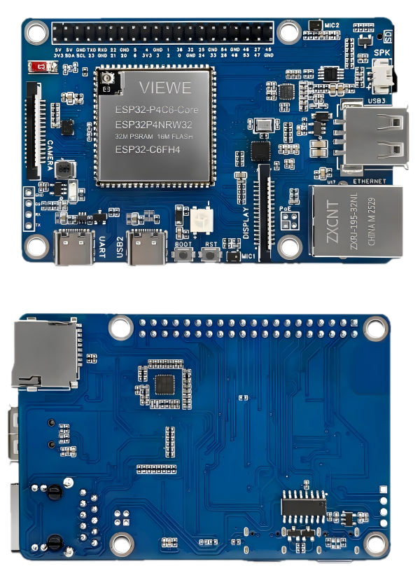

# ESP32-P4-Pi

## 1 引言
ESP32-P4-Pi-VIEWE开发板基于VIEWE ESP32-P4-Core模块设计，该模块集成了ESP32P4和ESP32-C6芯片，支持Wi-Fi 6和蓝牙5无线连接。它提供了多种人机界面（HMI）接口，包括MIPI-CSI（集成图像信号处理器ISP）、MIPI-DSI、SPI、I2S、I2C、LED PWM、MCPWM、RMT、ADC、UART和TWAI。此外，它支持USB OTG 2.0 H5，预留了RJ45以太网接口，可扩展POE（以太网供电）功能，并配备了40针GPIO扩展接口。

## 2 功能特点
### 2.1 中央处理器（CPU）
• 配备RISC-V 32位双核处理器（HP系统），具有数字信号处理器（DSP）和指令集扩展、浮点运算单元（FPU），主频率高达400 MHz。

• 配备RISC-V 32位单核处理器（LP系统），主频率高达40 MHz。

• 配备ESP32-C6 Wi-Fi/蓝牙协处理器，通过SDIO扩展Wi-Fi 6/蓝牙5等功能。

### 2.2 存储器
• 128 KB的高性能（HP）系统只读存储器（ROM）。

• 16 KB的低功耗（LP）系统只读存储器（ROM）。

• 768 KB的高性能（HP）二级存储器（L2MEM）。

• 32 KB的低功耗（LP）静态随机存取存储器（SRAM）。

• 8 KB的系统紧耦合存储器（TCM）。

• 32 MB的伪静态随机存取存储器（PSRAM）堆叠并密封在封装内部，16 MB的或非闪存通过四通道串行外设接口（QSPI）连接。

### 2.3 外围接口
• 强大的图像和语音处理能力，配备专用的图像和语音处理接口，包括JPEG编解码器、像素处理加速器（PPA）、图像信号处理器（ISP）和H.264视频编码器。

• 32MB PSRAM堆叠并封装在芯片内部；该模块集成了16MB Nor闪存。

• 板上引出了常见的外围接口：MIPI-CSI、MIPI-DSI、USB 2.0 OTG、以太网、SDIO 3.0 SD卡插槽、双麦克风、扬声器端子和实时时钟（RTC）电池端子。

• 板上引出了2×20引脚排针，可访问其余28个可编程通用输入/输出接口（GPIOs）。

## 3 应用领域
ESP32-P4功耗低，是以下领域物联网设备的理想选择：

• 智能家居

• 工业自动化

• 医疗健康

• 消费电子

• 智能农业

• 零售自助终端（销售点终端、自动售货机）

• 服务机器人

• 多媒体播放器

• 视频流摄像机

• 高速USB主机和设备

• 智能语音交互终端

• 边缘视觉人工智能处理器

• 人机界面控制面板

## 4 硬件描述
### 4.1 模块介绍

- 1、ESP32-P4模块
  - ESP32-P4核心 内置ESP32-P4NRW32、ESP32-C6、16MB Nor闪存、WIFI 6/蓝牙5
- 2、RGB发光二极管
- 3、以太网端口芯片
- 4、ES8311
- 5、麦克风1
- 6、扬声器接口
  - MX1.25 2P连接器，支持8Ω2W扬声器
- 7、Type-A接口
  - USB OTG 2.0高速接口
- 8、100Mbps RJ45以太网端口
- 9、PoE模块接口
  - 支持外接PoE模块连接，使用PoE供电
- 10、显示接口
  - MIPI-2通道
- 11、麦克风2
- 12、按键
  - 启动键：开机或复位时按下可进入下载模式
  - 复位键
- 13、Type-C接口
  - 可用于供电、程序烧录
- 14、Type-C UART接口
  - 可用于供电、程序烧录及调试
- 15、CH340C
- 16、ES7210
- 17、TF卡槽
  - 遵循SDIO 3.0接口协议
- 18、ESP32-C6 UART接口
- 19、电源指示灯
- 20、摄像头接口
  - MIPI 2通道
- 21、6轴姿态传感器
  - 3轴加速度计和3轴陀螺仪传感器
- 22、ESP32-C6贴片天线
  - 遵循SDIO接口协议，扩展支持Wi-Fi 6和蓝牙5
- 23、40PIN排针
### 4.2 GPIO定义

## 5 功能框图
ESP32-P4-Pi-VIEWE-Board的主要组件和连接方法如下图所示：

## 6 使用说明
本教程旨在指导用户搭建用于ESP32-P4硬件开发的软件环境，并通过简单示例演示如何使用ESP-IDF配置菜单、编译固件以及将固件下载到ESP32-P4开发板。
- 准备工作
- 硬件
  - ESP32-P4-Pi-VIEWE开发板
  - USB数据线（Type-A转Type-C，根据需要准备）
  - 电脑（Windows、Linux或macOS系统）
- 软件（建议使用集成开发环境安装ESP-IDF。如果您熟悉ESP-IDF，可以直接从ESP-IDF终端开始。您可以选择以下任意一种开发方式。）
  - VSCode + ESP-IDF插件（推荐）
  - Eclipse + ESP-IDF插件（Espressif-IDE）
  - Arduino IDE
## 入门指南
### ESP-IDF
- 新手请前往[ESP-IDF快速入门](https://github.com/VIEWESMART/VIEWE-Tutorial/blob/main/esp-idf/esp-idf_Beginner_Tutorial.md)，了解如何快速搭建开发环境并将应用程序烧录到开发板上。
- 开发板的应用示例存储在Examples文件夹中。您可以在[examples](examples/esp-idf)目录下输入idf.py menuconfig来配置项目选项。示例中会包含使用说明。如果没有包含，我们会尽快补充。您也可以直接联系我们，我们会优先处理。
### Arduino 集成开发环境（IDE）
我们正在努力准备。如果您有任何需求，请与我们联系。
## 7 相关文档
- [相机规格](peripheral/camera_datasheet.pdf)
- [显示器规格]()
- [ESP32-P4 数据手册（中文）](Datasheet/P4-Core%20Datasheet/esp32-p4-chip-revision-v1.3_datasheet_cn.pdf)
- [ESP32-P4 数据手册（英文）](Datasheet/P4-Core%20Datasheet/esp32-p4-chip-revision-v1.3_datasheet_en.pdf)
- [ESP32-C6 数据手册 (中文)](Datasheet/P4-Core%20Datasheet/esp32-c6_datasheet_cn.pdf)
- [ESP32-C6 数据手册 (英文)](Datasheet/P4-Core%20Datasheet/esp32-c6_datasheet_en.pdf)
- [ESP32-P4 技术参考手册（中文）](Datasheet/P4-Core%20Datasheet/Esp32-p4_technical_reference_manual_cn.pdf)
- [ESP32-P4 技术参考手册（英文）](Datasheet/P4-Core%20Datasheet/Esp32-p4_technical_reference_manual_en.pdf)
- [ESP32-P4-Pi 数据手册]()
- [ESP32-P4-Pi 原理图](Schematic/SCH_ESP32-ESP32-P4-Pi-VIEWE-V1.1_2025-10-23.pdf)
- [ESP32-P4-Core 原理图](Schematic/SCH_ESP32-P4-Core_2025-11-24.pdf)
- [ESP32-P4-Core 数据手册](Datasheet/P4-Core%20Datasheet/ESP32-P4-Core-VIEWE_SPEC_V1.0.pdf)
- [惯性测量单元](Datasheet/peripheral/QMI8658A.pdf)
  
## 8 产品尺寸

## 8.技术支持
联系人：VIEWE - Ayang

电子邮箱：smartrd1@viewedisplay.com

QQ技术交流群：1014311090

微信：

